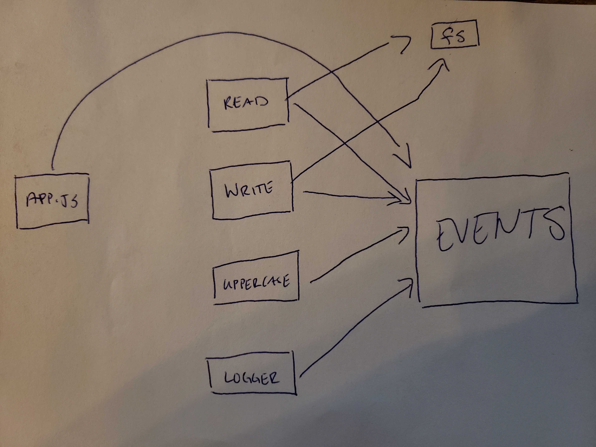

# LAB - Class 16

### Author: Qusai-Alhanaktah

### Links and Resources

- [submission PR](https://github.com/401-advanced-javascript-qusaiAlhanaktah/lab-16/pull/1)
- [ci/cd](https://github.com/401-advanced-javascript-qusaiAlhanaktah/lab-16/actions) (GitHub Actions)

### Setup
npm i jest eslint

#### How to initialize/run your application (where applicable)

- `npm test`

#### Tests

- How do you run tests?
     - 'npm test'
- Any tests of note?
     - jest --verbose --coverage
- Describe any tests that you did not complete, skipped, etc
     - evey test solved and another time i will cover more cases.
### My-app-data
- CLIENT_ID=f6167d4a92a5624a94b8
- CLIENT_SECRET=205ff19f090b57df023e1eed4a74b218b39fa733
### Groub name : Qusai-alhanaktah, Mohmmad-Alhawamdeh, Ayman-Alkwaldeh, Ahmad-Al-Mhasnah
#### UML
Link to an image of the UML for your application and response to events
